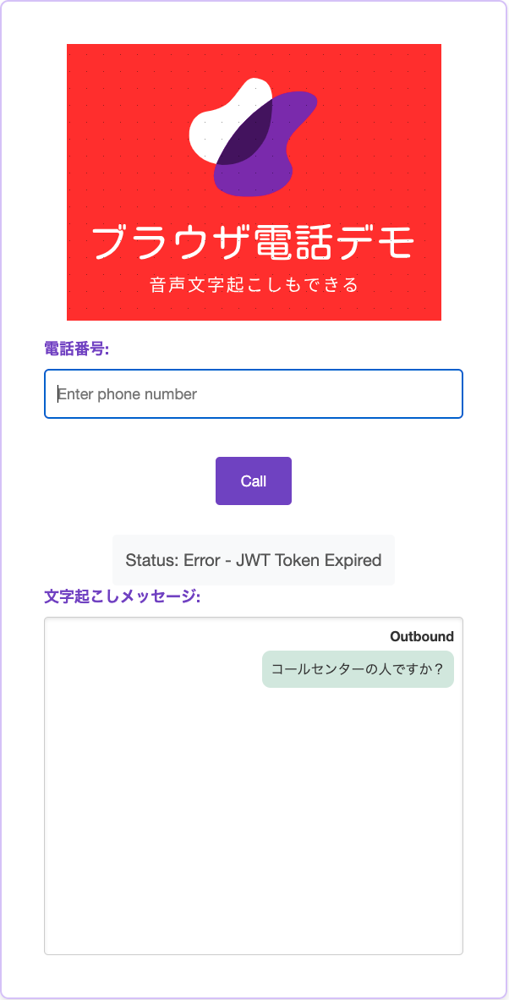

# ブラウザ電話のサンプルデモ＆リアルタイム文字起こし機能つき  
## 事前準備
1. Twiloのアカウントを既に持っていること
2. Twilio CLIがすでに導入済みであること
3. Twilio CLIでServerlessプラグインが導入済みであること  

## セットアップの仕方  
1. Githubからコードをダウンロードしてローカルに展開  
<pre>
Twilio-Browser-Phone-Demo
   ├── assets/  
   │ ├── index.html  
   │ └── logo.png  
   ├── functions/  
   │ └── voice-token.js  
   │ └── sync-token.js  
   │ └── voice-call.js  
   │ └── webhook.js     
   ├── images/  
   ├── .env.examples
   └── README.md  
</pre>  
2. プロジェクトの初期化  
   `cd ./Twilio-Browser-Phone-Demo/`  
   `twilio serverless:init`  

3. AccountSID/Auth_Tokenの取得
   1. TwilioのコンソールにログインしてHOME画面の下部にあるAccountSID/AUTH_TOKENを確認してください。  
   2. ローカルに展開したファイルに.env.examplesがあるのでファイルを開きます。  
   3. ファイル内に、「ACCOUNT_SID」「AUTH_TOKEN」とあるので、コンソールから取得した値を入力し保存してください。   
   
4. API Keyの作成   
   1. [公式サイト](https://www.twilio.com/docs/iam/api-keys#create-an-api-key)で作成手順を確認    
   2. ローカルに展開したファイルに.env.examplesがあるのでファイルを開きます。  
   3. ファイル内に、「API_KEY」「API_SECRET」とあるので、作成したAPIKEYの情報をそれぞれの変数に設定してください。     

5. 電話番号の購入  
   1. 電話番号を購入して下さい。手順は[こちら](https://help.twilio.com/articles/223135247)です。  
   2. 購入した電話番号をenv.examplesのファイル内にある「TWILIO_PHONE_NUMBER」に設定して下さい。番号は+で始まるE164形式で記載してください。  

6. Syncの作成　　
   1. Sync Serviceの生成
      1. 管理コンソールからSyncのメニューにアクセスします。
      2. Syncメニューの下にServicesというサブメニューがあるのでクリックします。
      3. Create New Sync Serviceというボタンがあるので、クリックします。
      4. 「Sync Service friendly name」という入力欄に任意のSyncサービス名を入れます。
   2. Sync Documentの作成  
      1. 先ほど作成したSyncサービス名をクリックします。  
      2. サービスのサブメニューにDocumentsというリンクをクリックします。  
      3. 「Create New Documents」ボタンがあるのでクリックします。  
      4. 「Unique name」に`Twilio-Browser-Phone-Demo-Transcription`を入れます。  
      5. 「Document Data」に下記を入れます。
        ```
            {
            "track": "outbound_track",
            "transcript": "メッセージデータ"
            }
        ```  
        1. 「Time to live」は空欄でよいです。  
   3. env.examplesファイルの設定  
      1. 「SYNC_SERVICE_SID」には、SyncサービスのSID（ISxxxxxxxxxx）を入れて下さい
      2. 「SYNC_DOCUMENT_NAME」には、Syncのドキュメント名（Twilio-Browser-Phone-Demo-Transcription）を入れて下さい。  

7. TwiML Binの作成　
   1. コンソールから、Twiml Binsのメニューをクリックしてください　   
   2. Create New TwiMLボタンを押して下さい。
   3. FRIENDLY NAMEには、「Twilio-Browser-Phone-Demo」と入力します。
   4. TWIMLは下記の通り入れて下さい。
    ```xml  
    <?xml version="1.0" encoding="UTF-8"?>  
    <Response>  
        <Start>   
            <Transcription    
            name="Call center transcription"  
            statusCallbackUrl="https://<Functions_domain_name>/webhook"  
            languageCode="ja-JP"  
            track="both_tracks"  
            inboundTrackLabel="customer"  
            outboundTrackLabel="agent"   
            transcriptionEngine="google"  
            speechModel="telephony"  
            profanityFilter="true"  
            partialResults="false"  
            enableAutomaticPunctuation="true"  
            />  
        </Start>  
        <Dial answerOnBridge="true" callerId="<コンソールで買った電話番号>">{{#e164}}{{To}}{{/e164}}</Dial>  
    </Response>  
    ```  
    5. XML内に２箇所修正する必要があります。  
       1. <Functions_domain_name>　こちらは、コードをデプロイした後に修正するので現状はそのままでOK。  
       2. <コンソールで買った電話番号>　こちらには、コンソールで購入した電話番号をE164形式で置き換えて下さい。  
8. TwiML Appの設定　　
   1. コンソールからVoice→Maange→TwiML appsに遷移します。
   2. Create New TwiML Appボタンをクリックします。
   3. Friendly Nameには任意の名前を入れて下さい。
   4. Voice ConfigurationのRequest URLには、先程作成したTwiML BinsのURLを指定してください。
   5. Twiml appsのSIDを.env.examplesのファイル内にある、「TWIML_APPLICATION_SID」に設定して下さい。  
9.  コードの修正　　
    1.  index.htmlの下記箇所で、もしSyncのドキュメント名を手順と異なる値にしていた場合には、こちらの「Twilio-Browser-Phone-Demo-Transcription」を変更してください。  
    ```js  
        syncClient.document('Twilio-Browser-Phone-Demo-Transcription').then(doc => {  
            console.log('Initial Sync data:', doc.data); // デバッグ用ログ  
            // 初期データの表示  
            if (doc.data && doc.data.transcript) {  
                addMessage(doc.data);  
            }  
    ```  
    2. ```.env.eample```ファイルのファイル名を、```.env```に変更してください。  
10. コードのデプロイ　　
    1.  プロジェクトホームへ移動
    ```shell-session
    $ cd ./Twilio-Browser-Phone-Demo  
    ```    
    2.  コードをTwilioのFunctions&Assetsにデプロイ  
    ```shell-session
    $ twilio serverless:deploy
    (実行結果)
    ✔ Serverless project successfully deployed
    Deployment Details
    Domain: twilio-browser-phone-demo-xxxxxx-dev.twil.io
    Service:
    Twilio-Browser-Phone-Demo (ZSxxxxxxxx)
    Environment:
    dev (ZExxxxxxxxx)
    Build SID:
    ZBxxxxxxxxxx
    Runtime:
    node18
    View Live Logs:
    https://www.twilio.com/console/functions/editor/ZS86ff05dad53e67160470087e4e839a22/environment/ZEdb3dd4975995d1f59cdb0391b0c8ce99
    Functions:
    https://twilio-browser-phone-demo-xxxxxx-dev.twil.io/sync-token
    https://twilio-browser-phone-demo-xxxxxx-dev.twil.io/voice-call
    https://twilio-browser-phone-demo-xxxxxx-dev.twil.io/voice-token
    https://twilio-browser-phone-demo-xxxxxx-dev.twil.io/webhook
    Assets:
    https://twilio-browser-phone-demo-xxxxxx-dev.twil.io/index.html
    https://twilio-browser-phone-demo-xxxxxx-dev.twil.io/logo.png
    ```
11. TwiML Binの修正　　
   1. コンソールから、Twiml Binsのメニューをクリックしてください　   
   2. 先ほど作成した「Twilio-Browser-Phone-Demo」をクリックして下さい
   3.  TWIML欄に下記のコードが表示されているとおもいます。
    ```xml  
    <?xml version="1.0" encoding="UTF-8"?>  
    <Response>  
        <Start>   
            <Transcription    
            name="Call center transcription"  
            statusCallbackUrl="https://<Functions_domain_name>/webhook"  
            languageCode="ja-JP"  
            track="both_tracks"  
            inboundTrackLabel="customer"  
            outboundTrackLabel="agent"   
            transcriptionEngine="google"  
            speechModel="telephony"  
            profanityFilter="true"  
            partialResults="false"  
            enableAutomaticPunctuation="true"  
            />  
        </Start>  
        <Dial answerOnBridge="true" callerId="<コンソールで買った電話番号>">{{#e164}}{{To}}{{/e164}}</Dial>  
    </Response>  
    ```  
    4.  下記の箇所を修正してください。   
       1. <Functions_domain_name>　の箇所にコードをデプロイした際に表示された、「twilio-browser-phone-demo-xxxxxx-dev.twil.io」  というドメインを置き換えて下さい。  
       2. 完了したら保存してください。
12. 


## デモの実行  
1. ブラウザでトップ画面を開く  
コードをデプロイした際に表示された、index.htmlのURLにブラウザでアクセスして下さい。  
例えば、こちらです。  xxxxxxの部分はデプロイした人ごとに異なります。  
https://twilio-browser-phone-demo-xxxxxx-dev.twil.io/index.html  
  
2. 電話番号欄に、架電先の電話番号を入れます。番号は＋から始まるE164形式で入れて下さい。  
3. Callボタンを押して下さい  
4. 通話が開始され、画面下部の文字起こしメッセージ欄に会話が表示されれば成功です。  